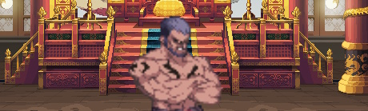
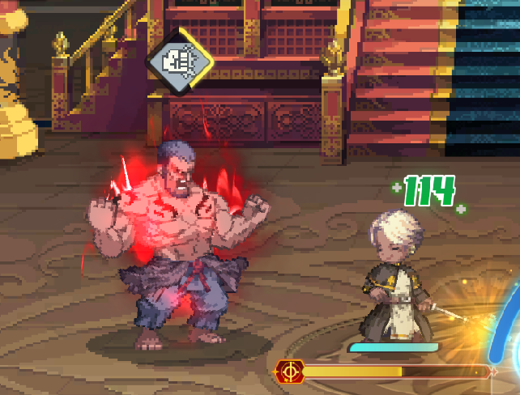
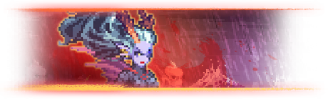
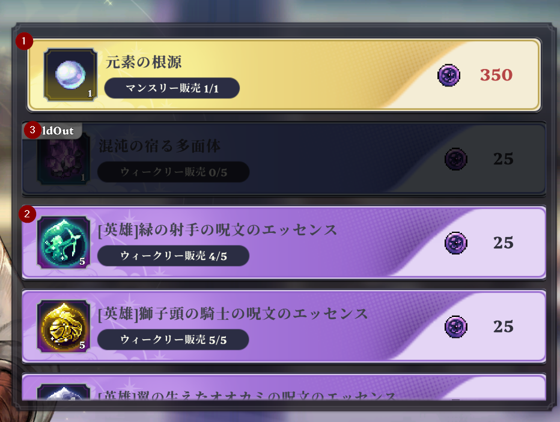

チャプター４をクリアすることで解放されるエンドコンテンツです。 
低難易度の「破滅のインク」はある程度レベルが上がれば自然とクリアできますが 
高難易度の「戦乱の暴風」はしっかりとした準備が必要です。
凸５の強襲騎士とバッファーが揃っていれば49～51レベルでクリア可能ですが 
そうではない場合、装備や聖物の強化、聖画の復元をしっかりと行ってもLv55～57までクリア出来ないのも
ザラなの諦めず頑張りましょう！ 

「戦乱の暴風」からはそれぞれのボスに専用のルールが付与されます。 
余程のことが無い限り、ルールを無視してクリアすることは難しいので 
しっかりとルールを確認してから挑みましょう。 
また、一度使ってる騎士は別のボスには使えないので最低でもDPSが3人必要という鬼畜仕様です。 

# 戦乱の暴風
## 復讐の王女

### ルール付与
**【イングリッドの試練：HARD** 
治癒量が75％減少する。

**【復讐の王女の試練2】** 
リンク中の味方騎士がいない場合、復讐の王女の被ダメージ量が20％減少する。

**【復讐の王女の計略】** 
地属性騎士と風属性騎士のダメージ量が30％増加する。 
リンク状態のときは30％さらに増加する。

### 解説
このボスは動きの予測が非常に難しく、慣れるまではパリィを取るのがかなり難しいです 
また、HPが50％以下にするとバリアを貼り、ボスとは独立して攻撃してくる氷の弾を射出してきます。 

ここからが本番。まだチームの戦力が足りてない場合、ここが足切りラインになってしまいがちです。 
ある程度火力が出せればゴリ押しでクリアも可能ですが、 
そうではない場合無敵持ちの騎士（クレラン・スカーレット・シビラ）を編成して無敵回避を駆使してクリアするのがおすすめ。 

💡Tips：
リンク状態じゃないとまとまなダメージが入らないため 
戦闘開始直後にパリィを決めてリンクゲージを素早く確保するのがおすすめです。 
また、先述した通りHPが50％を下回ると発動する特殊ギミックが非常に厄介で、攻略というより**火力勝負**又は**無敵回避ゲー**に変わってしまう。 

編成例：
【スカーレット凸1－デイナ－エトナ凸１】（筆者は初攻略時は【スカーレット凸1－デイナ凸１－フェンチェラ凸３】でした。
また海外では【シビラ凸５－アラゴン凸５－デイナ】での3分クリア報告もあります。

## バートス

### ルール付与
**【バートスの試練：HARD】** 
バートスは、火傷、凍結、風化、感電、地震に免疫状態になる。

**【バートスの計略】** 
水属性騎士と強襲クラスの騎士のダメージ量が30％増加する。

### 解説
黒い亀裂初挑戦者が最初の挑戦相手として最もおすすめのボスです。 
火力自体はそこそこ高いですが攻撃パターンが単純で、パリィも比較的取りやすいです。 
バートス戦で最も大切な要素は **ブレイクゲージがおおよそ50%** になる辺りまでどのように戦いを進めるかです。 
ブレイクゲージがおよそ50％になると、ボスが【特殊ギミック】を発動します。 

一定時間内にボスを攻撃してチャージをキャンセル(拳ゲージを０に)することがカギになります。 

チャージを潰した後または失敗した場合もこの後7連撃の予告攻撃をしてきます。 
もし潰すことが出来ればここでカウンターを４回取ることで相手のダウンゲージを大幅に削る事が出来ます。 
（もし潰せなかった場合、全ての攻撃をパリィしないといけなくなります） 
バートスはブレイクダメージに非常に弱いため、この点を意識しておきましょう。 
また、ブレイク後は一定時間【燃焼段階】に入り、連続で攻撃してきますがこの間はブレイクは取れないので攻撃とパリィに集中しましょう。 
戦闘中にブレイクできる回数は最大３回です。積極的に狙っていきましょう。 

💡Tips：
もし【アラゴン凸３】を持っているなら【固有スキル】でバートスの特殊ギミック攻撃をオートパリィによりほぼ無力化できます。 
土属性パーティを持っている場合はお試しあれ。
ただし、【トリックスター】を使う場合は、この戦闘で【砂時計】を使わないようにしましょう。 
バートスは計略により異常状態に掛からないので。

おすすめ編成：
【クレア・シビラ凸５－アラゴン凸３↑－グレース】 
または、DPSとサポートを組み合わせた標準的なチーム構成でもOK。 
バートスのギミックを理解して立ち回れば、十分勝利可能です。 

## パルマナ

### ルール付与
**【パルマナの計略】** 
制圧クラスの騎士が与えるブレイクダメージ量が150％増加する。

**【パルマナの計略2】** 
ブレイク状態のとき、強襲クラスの騎士からの被ダメージ量が80％増加する。

**【パルマナの試練：HARD】** 
ブレイク状態でない時の被ダメージが40％減少する。

### 解説
このボスは現時点で最も難易度が高い相手だと感じます。 
この戦闘のメカニクスは、完全に【パルマナのブレイク】を中心に構成されています。 

【パルマナ】戦では、現在持ってる最強のDPSとブレイカーで編成するのがおすすめです。 
主力DPSを投入する前に、できる限りブレイクを狙い、最適なタイミングで火力を集中させましょう。 
「60秒間なんとなく攻撃する」よりも、「ブレイクをしてしっかり有効ダメージを与える」方がはるかに効果的です。 
（申し訳ない、まだ☆３取れてないのであんまり書くことがぁ・・・ ）

💡Tips：
パルマナの多くの攻撃は【パリィ不可】であるため、パリィでリソースを回収するチャンスはほとんどありません。 
そのため、**自分でスイッチゲージを回復し易いなサポーターやブレイカー（ヴァイオレット、グレース、サラ**の採用を強くおすすめします。 
短期決戦を狙う場合は倍率が高めのブレイカー（ロアンやシク）を採用して出来るだけ攻撃力を盛りましょう。

編成例：
【レティシア凸３－ヴァイオレット凸３－ロアン凸１】 
または【フェンチェラ凸３－グレース－サラ凸３】 
現状の最適解は【ルナ凸5－グレース・デイナ・オリベット凸５－シク凸５】だと思いますが 
現状それだけ騎士を揃えてる人の方が珍しいかも。 

### おすすめ攻略順
個人的なおすすめ攻略順は以下の通りです： 
1. バートス 
2. 復讐の王女 
3. パルマナ 

バートスはパリィのタイミングさえ掴めれば比較的簡単に攻略できます。 
まずはここで亀裂の報酬を確保して**英雄の呪文のエッセンス**を集めましょう。 
（10月22日のアップデートから課金ストアでも購入可能になりましたが 😂）

正直自分がまだ☆７までしか取れてないので偉そうな事言えないので 
ガチ勢の方、ご指摘ありましたら著者のXにお願いします！ 

### お店の品の優先順位

初攻略時はエッセンスを優先してもいいと思います。 
ですが元素の根源は足りなくなりがちなので余裕が在れば交換しておきましょう。 