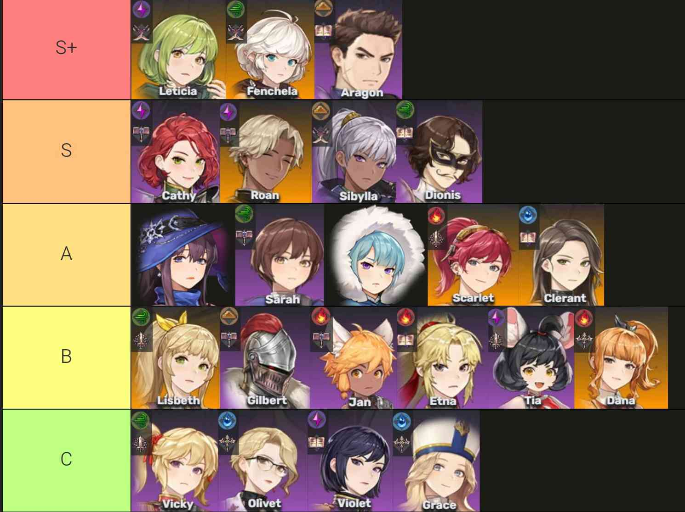
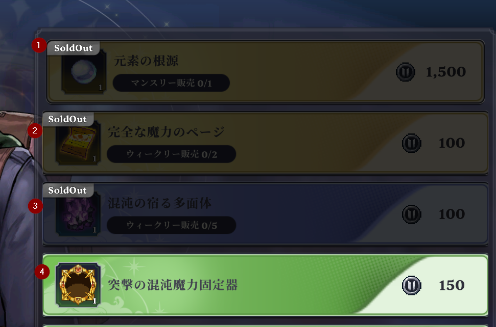

他と違いこれだ！って情報が無いので書くことはそこまでありませんが自分が知ってることを書いて誰かの為になれば幸いです。
 

まずよく見るPvPのTier表ですが

これを見てS+キャラさえ居れば勝てる！と思うのは危険です。 
なぜなら最低限の凸がないと評価がかなり違うからです。 
例えばS+のレティシアは凸0だとあまり強くないですが凸5にするとかなり強力になります。 
フェンチェラは凸３。アラゴンも凸３です。 
これを鵜呑みにしてアラゴン凸０なんて入れようものならただのカモになってしまいます。 
また、Aにいるルナですがもし相手が専用聖物凸５なんて付けてたら逃げるのが吉です。 
あとは相手の編成・順番に合わせて騎士を変えるのも重要です。 

PvPで勝つためにはAIの挙動と決闘の仕様を掴むのが大切です。
- 基本的に特殊→固有→基本の順番で使いますがたまに違うキャラがいるっぽい？
- 死亡時の交代には2秒ほど無敵が付く。
- 一部の技は交代で無敵回避できる。
- 相手は7～8割ＨＰが削れると交代する。

この2番目がかなり大切でメインのDPSキャラが死にそうなタイミングで交代。 
交代したキャラを犠牲にDPSキャラが無敵時間中に攻撃。 
これでDPSキャラの攻撃時間を伸ばすが事が出来て結果2人倒せたりします。 
また、フェンチェラの固有攻撃等の攻撃の発生にラグがある場合 
発生の瞬間に交代することで8割ほどダメージを回避できます。 

例えば 
【レティシア-ロアン-アラゴン凸3】V.S.【ルナ-フェンチェラ-レティシア】 
レティシアを先頭に置くと攻撃方法は特殊→固有→基本です。 
ルナはまず、コールドスナップでダイヤモンドダストを選んでから攻撃します。 
この場合レティシアの雷の発生の方がかなり早いのでほぼほぼ競り勝つ事が出来ます。 
ルナが後ろに下がり、フェンチェラが出てきたら特殊→固有の順番で攻撃してきますので 
ロアンに交代してフェンチェラの固有を無敵回避しつつ攻撃。 
ブレイクを取ってフェンチェラを撃破。 
ロアンを犠牲にして無敵時間でレティシアで攻撃 
これで相手のレティシアを撃破後残りＨＰ2割ほどのルナをアラゴンで撃破。 
（この時アラゴンはスタミナがマックスなので固有スキルでルナの攻撃をほぼパリィするので競り勝ちます） 
毎回上手くいくわけではないですがもし戦闘力が同じ程度の相手に競り勝つ場合には必要なテクニックです。

### ショップのアイテム優先度

個人的に元素の根源が最優先ですがマンスリー報酬なのでその月のうちに回収できる目途がついてる場合ページや多面体を先に取るのもアリ。