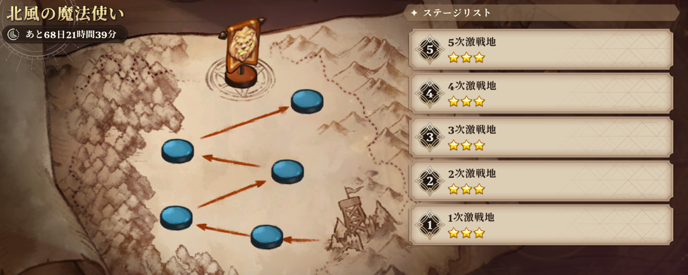
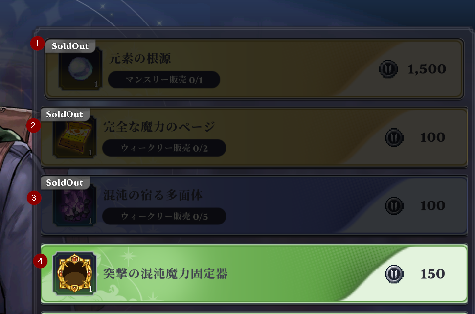

チャプター３をクリアすることで解放されるコンテンツです。 

1次戦線～５次戦線のレベル別のダンジョンを攻略していくのですが進むにつれて敵が強くなり、計略（デメリット効果）が増えていきます。
攻略進度は毎週リセットされ、1次から再度攻略します。

### 戦線の攻略

戦線が進むごとに敵の計略が１つずつ増えていきます。 
特に一番上のの計略が後半になるとかなり厄介で弱点属性でないとほぼ解除不可能です。 
そして、別の計略により失敗すると相手が無敵状態に入り時間稼ぎをしてきます。 
ですので、SSRの他属性の騎士よりもSRの弱点属性の突撃・強襲の騎士がいた場合そちらの方が上手くいく場合も多いです。 
レベルと聖画の復元がかなり進んで居れば他属性でもクリアできますがそれでも属性を合わせた方が楽です。 
基本的にレベル相応に育てた騎士で且つ属性が合っていればクリアは可能です。 

また攻略に苦労されている場合は相手の配置は固定ですので何回かチャレンジして場面ごとの立ち回りを固定化していくと幾分か楽になるかと。

### ショップのアイテム優先度

個人的に元素の根源が最優先ですがマンスリー報酬なのでその月のうちに回収できる目途がついてる場合ページや多面体を先に取るのもアリ。